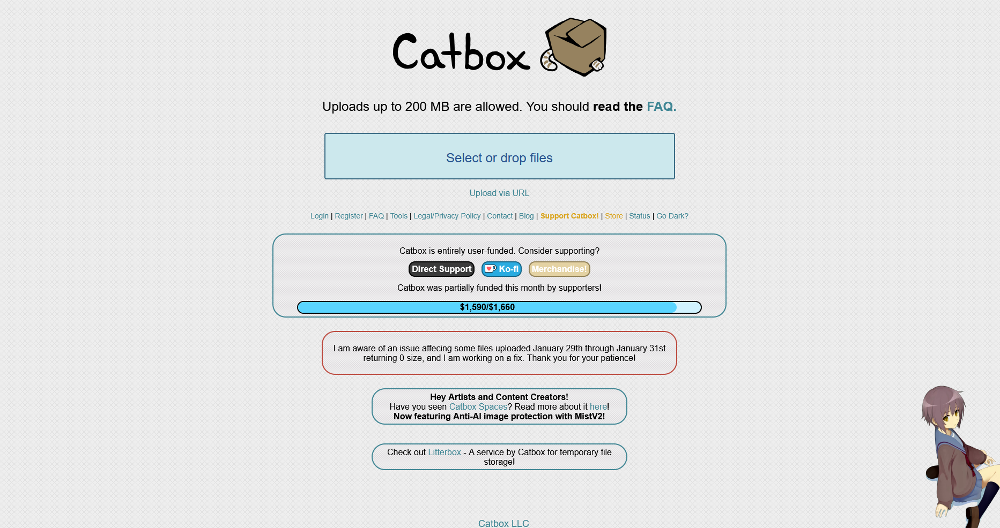
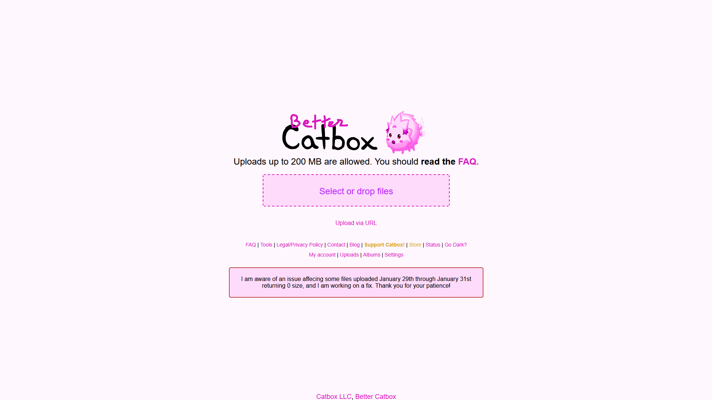
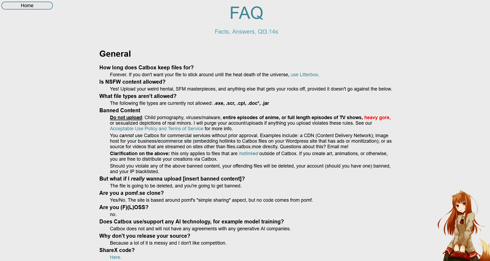
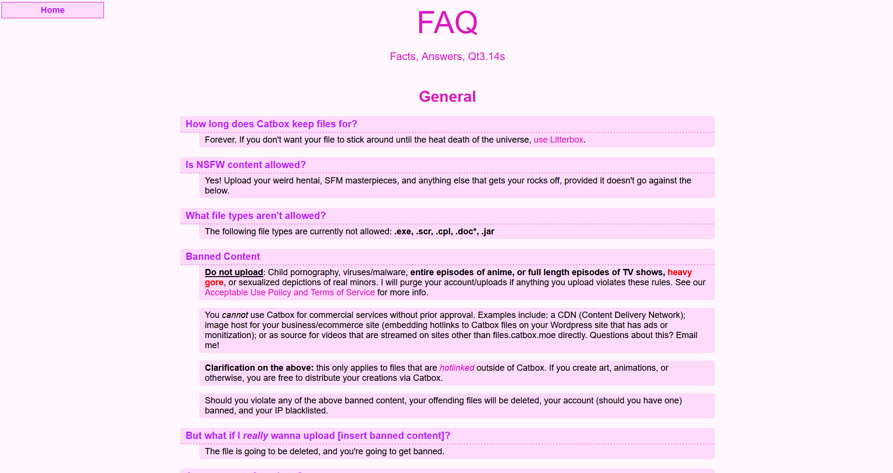

# Zerochan Instant Image Downloader

A userscript that adds instant download buttons to images on Zerochan.net, allowing you to download full-resolution wallpapers directly from the gallery pages. Allow bulk download too.

<!--  -->

<picture>
  <source media="(prefers-color-scheme: dark)" srcset="assets/logo_dark.png">
  <source media="(prefers-color-scheme: light)" srcset="assets/logo_light.png">
  
</picture>

## Features

- Design Reworked for a better visual

## Installation

### Option 1: Using Tampermonkey (Recommended)

1. Install the [Tampermonkey extension](https://www.tampermonkey.net/) for your browser (Chrome, Firefox, Safari, Edge, etc.).
2. Open Tampermonkey and create a new script.
3. Copy and paste the entire contents of `script.js` into the script editor.
4. Save the script.

### Option 2: Manual Injection

1. Navigate to the website
2. Open your browser's developer console (F12 or right-click > Inspect > Console).
3. Copy and paste the entire contents of `script.js` into the console.
4. Press Enter to execute the script.

### Option 3: Using Greasy Fork

1. Install a userscript manager like [Tampermonkey](https://www.tampermonkey.net/) or [violentmonkey](https://violentmonkey.github.io/)
2. Visit the script page on [Greasy Fork]() and search for "Zerochan instant image downloader".
3. Click the "Install" button on the script page.

## Preview (before/after)

### Homepage

### FAQ page

## Note
This script simply makes the site more comfortable to use. It only adds visual elements and a few features that you may find useful.

This userscript does not collect any data and does not prevent any actions on the site.

As I am not a heavy user of catbox, if you encounter any issues or would like to help, feel free to do so. 